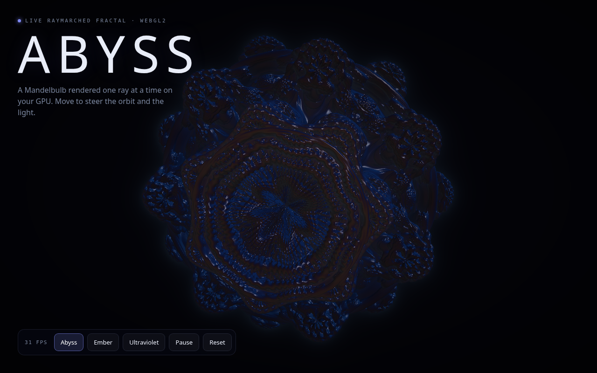

# Abyss

**Fall into the bulb.** A Mandelbulb fractal raymarched live on your GPU, in the browser: distance-estimated marching, soft shading, hashed stars. Move to steer the orbit and the light. WebGL2, no server, no dependencies, no build step.

**→ Live: https://abyss.signalizeai.org**



## What it is

One fullscreen triangle and one fragment shader. Each pixel marches a ray through a power-8 Mandelbulb distance field (90 steps), shades the hit with tetrahedron normals, diffuse plus specular light, step-count occlusion, and a cosine palette, or falls through to procedural stars. The camera orbits on its own; the pointer bends the orbit and moves the light.

## Controls

- **Move** — steer the orbit and the light direction
- **Palette** — Abyss / Ember / Ultraviolet
- **Pause**, **Reset**, and a live fps readout

## Run locally

Open `public/index.html` in a browser, or serve the folder:

```bash
npx serve public
```

## License

MIT
